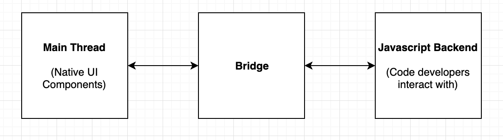
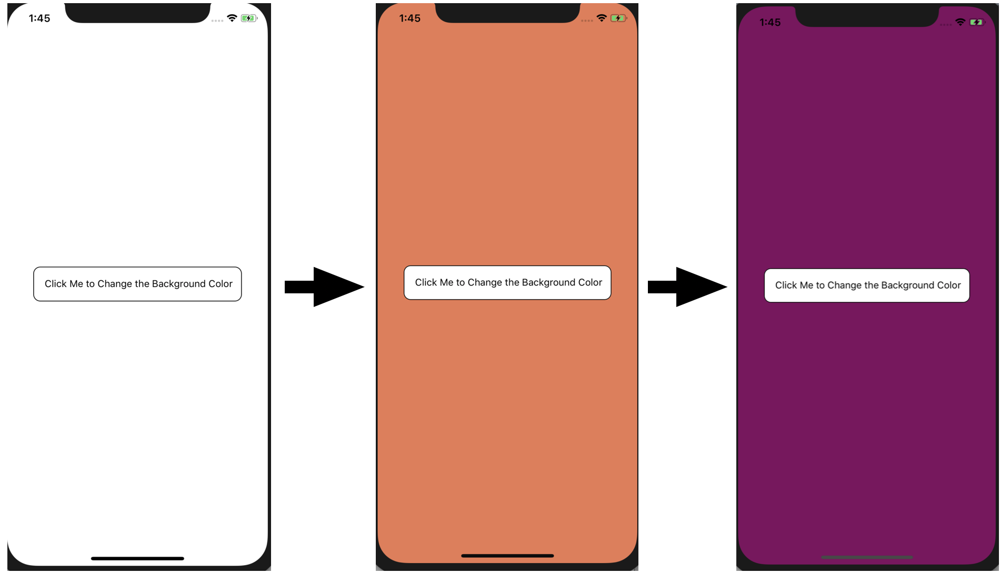

# Case Study: React Native
## Technology
- React Native uses Javascript to create mobile applications for both Android and iOS devices. I think if the project were to be started today, the developers would still choose to use Javascript. Javascript unlike Java is a language that users can pick up pretty quickly and intuitively, since there is not the need to learn about object oriented programming. This makes using the framework more accessible to all users regardless of skill level or knowledge of programming.
- There are two different methods that you can use to install and build an app using React Native. You can either use the Expo command line interface or the React Native command line interface.
  - The Expo Command line interface requires Node 10+ to be installed. In order to install this interface, create a new app, and run the program, you'd enter the following commands
  ``` 
  npm install -g expo-cli
  expo init MyReactProject
  cd MyReactProject
  npm start # you can also use expo start
  ```
  One benefit of using the Expo Method is that you do not need to install Xcode or Android Studio because you can preview you app right on your phone. You can download the Expo app onto your device, and as long as your device and your computer are on the same wireless network, you can pull up the current prototype on your phone. You either scan the QR code that is printed in your terminal for Android Devices or follow the onscreen instructions for iOS devices. You can also install Xcode and Android Studio to run emmulators, which you would run using either the `npm run ios` or `npm run android` commands.

  - Using the React Native interfacfe requires Node 8.3 or newer, which is better for people who don't always have the newest versions of different technologies installed. To install the cli, and create a new application, you'd enter the following commands
  ```
  npm install -g react-native-cli
  react-native init MyReactProject
  cd MyReactProject
  ```
  For this method, you must install Xcode and Android Studio, to use the emmulators to preview your application. You'd run either the `react-native run-ios` or `react-native run-android` commands, depending on which device you'd like to use.
- React Native uses __many__ libraires, which you can find [here](https://github.com/facebook/react-native/tree/master/Libraries)

## Testing
- For testing your projects as a developer, the docs recommend using Jest to test. It allows you to test individual components and styles using Snapshots. You can run the snapshot testing setright from the command line, so you don't have to wait for the whole project to build and load onto an emmulator or pull it onto your device to see if your componenets work. It is also quick and allows your to step through your code to debug so you know exactly which part of your component is breaking. They've also added the ability to mock data and components to test your applications even more. Another option for testing is to use Enzyme to test individual componenet. Although it has a nicer API than Jest, it requires more dependencies to be installed. When you run a snapshot test using Jest, the rendured output from the component is saved in a snapshot file. You can then retest the same components and compare the snapshot files to easily see why a snapshot failed if the previous test passed. 
- For contributors, React Native uses both Circle CI and Appveyor to do continuous integration, but prefers Circle CI since it runs on and tests more platforms than AppVeyor.

## Software Architecture
- React Native, like ReactJS, works using the idea of components. There are some basic components included with the framework like View, FlatList, Checkbox, and Text, but you can also create your own components with it's own stylings and properties. Those components then are transformed into the correct native representations for your specific platform iOS or Android. 
- There are 2 threads that function in every React Native app, the main thread and the Javascript backend. The main thread is what the user interacts with, and is responsible for rendering the different components correctly depending on the device. The Javascript backend is the thread that the developer has control over. This is the code that we write in our projects that contains the functions and styling details for these components. These two threads are connected by a bridge that allows for constant asynchronous communication between the two.
<center></center>
- Due to React Native's use of components, although you can create a standalone application, you can build upon and combine different projects through the reuse of components. Each component serves as an API that you can include in new or existing projects. Although they sound similar, you are NOT able to make a ReactJS web application from a React Native application. That being said, the basic principles behind the idea of components and the main threads are the same, so it would be relatively simple to "translate" your code and create a web application.
- React Native tends to lean more towards functional components. The individual components you see on the screen all of have their own functions. You can also pass arguments to the individual components, to customize the result, but these components are all able to be reused in different projects. For example, you can create and render a Text component and choose which values to be displayed. In the following example, the name property is being displayed in the Text component.

```
render() {
    return <Text>Hi {this.props.name}!</Text>;
  }
``` 

## Issues
- I've found two open tickets on Github that have similar issues. The first one, ticket #22458, is about the user wanting to select specific wext when using the Text component. They set the Text component's 'selectable' attribute to true, but that seems to select the entirety of the text in the Text component rather than allowing them to choose which text they want. This seems to be a bug which could be fixed by adding another selectable feature. Maybe by turning the text input into an array and using the point in the cursor to index it with a start and end point. There is currently a new library that a user can use called "react-native-selectable-text" created by Astrocoders.
- The second issue is ticket number #22265, where a user is having trouble reloading their Emulator by double tapping the R key. The user has a text input component in their application and when they double tap 'R', the software keyboard pops up and types a letter rather than reloading. The text input component works in such a way that any key press from the hardware counts as a software key press as if the user is typing into that Text input. A way to fix this is to reload their emulator by pressing CTRL + R rather than double r. 

## Demo
- For my first demo, I created a simple application that changes the color of the background, every time the button is pressed. 
<center></center>
<center>You can see 2 button presses and the changing of color in this picture</center>

- In my final demo, I created a Todo application that uses Google Firebase as the database to allow for data persistence. Each individual todo item is a component that contains a check box and delete button to be able to either mark a task as complete or delete the task completely. There is also an input component and an addTodo button that adds the new todo to the database and display.
<center></center>